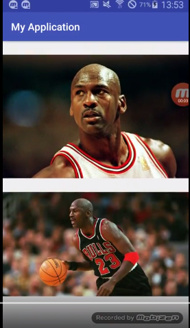

# Why RecyclerView?

Android has a limit of heap memory. So when we insert many videos or images in youer app, I'm sure "Out of Memory(OOM)" happens. We can handle this issue by using a RecyclerView RecyclerView is similar to ListView, but it is more smart about heap memory.

## Problems
1. if you use a ListView loading Bitmap image items in real time, you have out of memory errors.

---
## Code
Before you write this code, you should add this library in **build.gradle**
To load images, we can use Glide, which is developed from Google. It is very useful and efficient.
~~~ gradle
dependencies{
compile 'com.android.support:recyclerview-v7:25.2.0'
compile 'com.github.bumptech.glide:glide:3.7.0'
}
~~~

**activity.xml**
~~~ xml
<?xml version="1.0" encoding="utf-8"?>
<LinearLayout xmlns:android="http://schemas.android.com/apk/res/android"
    xmlns:app="http://schemas.android.com/apk/res-auto"
    xmlns:tools="http://schemas.android.com/tools"
    android:layout_width="match_parent"
    android:layout_height="match_parent"
    tools:context="com.example.nb201612072.myapplication.MainActivity">

<android.support.v7.widget.RecyclerView
    android:layout_width="match_parent"
    android:layout_height="match_parent"
    android:id="@+id/recyclerView">
  </android.support.v7.widget.RecyclerView>

</LinearLayout>

~~~
**listitem.xml**
~~~ xml
<?xml version="1.0" encoding="utf-8"?>
<LinearLayout xmlns:android="http://schemas.android.com/apk/res/android"
    android:orientation="vertical" android:layout_width="match_parent"
    android:layout_height="match_parent">

    <ImageView
        android:layout_width="wrap_content"
        android:layout_height="wrap_content"
        android:id="@+id/img"/>
</LinearLayout>
~~~

**MainActivity.java**
 
I wrote down urls, but I recommand you programmatically get your urls. These urls are jordan images through searching google.
**LayoutManager** handles RecyclerView's layout like Item's array (num of items per a row)
~~~ java

public class MainActivity extends AppCompatActivity {

    ArrayList<String> ImgUrl= new ArrayList<>();
    RecyclerView recyclerView;
    LinearLayoutManager Manager;
    Adapter adapter;

    @Override
    protected void onCreate(Bundle savedInstanceState) {
        super.onCreate(savedInstanceState);
        setContentView(R.layout.activity_main);

        ImgUrl.add("https://upload.wikimedia.org/wikipedia/commons/thumb/b/b3/Jordan_Lipofsky.jpg/170px-Jordan_Lipofsky.jpg");
        ImgUrl.add("http://cdn.playbuzz.com/cdn/62b7af36-65b7-41aa-8db2-e34fd8a76acf/62c5efd3-fa55-464b-8ee5-9a3e2543c830.jpg");
        ImgUrl.add("http://cdn.playbuzz.com/cdn/fa415381-3e73-4678-915d-7abf8983ce09/813d91c3-f7c9-4a20-9e7b-7e7b6da78941.jpg");
        ImgUrl.add("http://cdn.playbuzz.com/cdn/62b7af36-65b7-41aa-8db2-e34fd8a76acf/1e93e32c-7662-4de7-a441-59d4c29d6faf.jpg");
        ImgUrl.add("http://cdn.playbuzz.com/cdn/5cb29908-40a5-42d4-831d-5bea595bcf05/3e9f0c63-60c6-4a0c-964c-1302d56295da.jpg");
        ImgUrl.add("https://pmcfootwearnews.files.wordpress.com/2015/06/michael-jordan-chicago-bulls.jpg");
        ImgUrl.add("http://healthyceleb.com/wp-content/uploads/2015/03/Michael-Jordan.jpg");
        ImgUrl.add("http://thelegacyproject.co.za/wp-content/uploads/2015/04/Michael_Jordan_Net_Worth.jpg");
        ImgUrl.add("http://www.guinnessworldrecords.com/Images/Michael-Jordan-main_tcm25-15662.jpg");
        ImgUrl.add("http://sportsmockery.com/wp-content/uploads/2015/03/michael-jordan-1600x1200.jpg");
        ImgUrl.add("https://cdn-s3.si.com/s3fs-public/si/dam/assets/13/02/13/130213172915-michael-jordan-05717484-single-image-cut.jpg");
        ImgUrl.add("http://cdn.playbuzz.com/cdn/5cb29908-40a5-42d4-831d-5bea595bcf05/5246cb13-4c32-45ba-89ad-c63cbbcdfde3.jpg");
        ImgUrl.add("http://i.dailymail.co.uk/i/pix/2015/09/24/17/2CB89DDF00000578-0-image-a-1_1443111464150.jpg");
        ImgUrl.add("https://s-media-cache-ak0.pinimg.com/originals/f2/b5/f2/f2b5f2aeb31e079f7e48ac0c338a8507.jpg");

        this.recyclerView = (RecyclerView)findViewById(R.id.recyclerView);
        Manager = new LinearLayoutManager(this);
        recyclerView.setLayoutManager(Manager);
        adapter = new Adapter(ImgUrl, this);
        recyclerView.setAdapter(adapter);

    }
}
~~~

**Adapter.java**

**ViewHolder** holds item's views. **RecyclerView recycles the holders as ten holders are only created.** New holder is created in onCreateViewHoler and the return value goes by onBindViewHolder, which handles UI changes like putting images into ImageView. **If positon is over ten, onCreateViewHoler is not called and the onBindViewHolder reuses the holders existed.**
Glide is module for loading url images into view, directly. To change UI, we have to work in onBindViewHolder, so we call the Glide in onBindViewHolder.
~~~ java
public class Adapter  extends RecyclerView.Adapter<Adapter.ViewHolder>{

    ArrayList<String> urls;
    Context context;
    //constructor
    public Adapter(ArrayList<String> ImgUrl, Context context_)
    {
        this.urls = ImgUrl;
        this.context = context_;
    }

    public static class ViewHolder extends RecyclerView.ViewHolder
    {
        private ImageView image;

        public ViewHolder(View v)
        {
          super(v);
          image =(ImageView)v.findViewById(R.id.img);
        }

        public ImageView getImage(){ return this.image;}
    }

    @Override
    public Adapter.ViewHolder onCreateViewHolder(ViewGroup parent, int viewType)
    {
        View v = LayoutInflater.from(parent.getContext()).inflate(R.layout.listitem, parent, false);
        v.setLayoutParams(new RecyclerView.LayoutParams(1080,800));
        return new ViewHolder(v);
    }

    @Override
    public void onBindViewHolder(final ViewHolder holder, int position)
    {
        Glide.with(this.context)
                .load(urls.get(position))
                .diskCacheStrategy(DiskCacheStrategy.ALL)
                .into(holder.getImage());
    }

    @Override
    public int getItemCount()
    {
        return urls.size();
    }

}
~~~

you'd like to watch my demo.
<iframe width="560" height="315" src="https://www.youtube.com/embed/SNLlr6fRmkA" frameborder="0" allowfullscreen></iframe>
