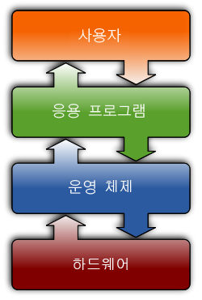
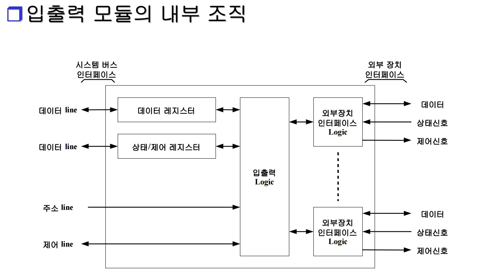
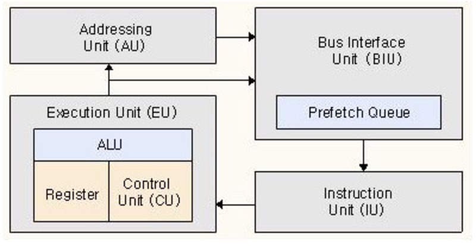

이번 운영체제부터는 한글로 포스팅을 하기 시작했다. 자세한 이해가 중요한 분야이기 때문에 표현력과 가독성을 높이기 위해 한글을 사용하기로 했다.

#### [용어정리]
System: 특정한 목적을 위해 만들어진 규칙들이나 요소들이 모여있는 구조를 의미한다. 
resource: 프로세스를 동작하기 위한 하드웨어 구성요소를 의미한다. 

# 운영체제(OS)란 무엇일까?
운영체제는 Operating System으로 System Hardware를 관리하고, 응용 프로그램을 동작시키기위해 Hardware resource를 할당하는 역할을 한다.
즉, 사용자가 프로그램을 실행할 때, 운영체제를 통해 Hardware와 소통한다.

#### 목적:
예전에 운영체제가 없었던 시절이 있었다고 한다. 그때는 사용자가 어떠한 프로그램을 실행하기 위해서 직접 Hardware를 관리해야했고, Hardware를 관리하기 위해서는 매우 어려운 interface를 익혀야했다.
하지만 운영체제는 사용자의 입력에 의해 거의 자동적으로 hardware resource를 할당한다.   
운영체제는 사용자가 hardware의 resource를 편리하고 효율적으로 사용하기 위해서 존재한다. 그래서 운영체제는 **편리성, 효율성** 을 모두 만족해야한다.

#### OS의 구성

OS를 공부하기 전에 우리는 컴퓨터의 전반적인 구조에 대해 알필요가 있다. 

| 종류         | 역할      | |                                             
|:------------|:---------|    |                                            
| kernel      | 우리가 흔히 운영체제라고 부르면, 이것을 의미한다. 하드웨어 자원을 관리하고 소프트웨어가 실행될 환경을 제공하는 소프트웨어이다.( Linux는 GNU OS에서 사용되는 kernel)|
| System Call | Kernel에 대한 interface|
| Shell       | 다른 응용프로그램을 실행하기 위한 interface를 제공하는 프로그램|

넓은 의미로 위의 것들을 모두 포함한 것이 운영체제이지만, kernel만 가지고 운영체제라고 부르기도 한다.(e.g Linux, OSX ..)

# Computer의 Hardware
운영체제가 hardware를 제어하는 역할을 하기 때문에 운영체제를 잘 이해하기 위해서는 컴퓨터 hardware 구조를 알 필요가 있다.
#### 1. 입출력 장치
입력장치: 마우스, 키보드 ..
출력장치: 모니터, 프린터 ..

입력장치는 사용자가 컴퓨터를 제어하는 가장 기본적인 인터페이스이다.
입력된 데이터가 내부의 여러과정을 거쳐 출력장치에서 표현된다.

#### 2. I/O modules ( I/O controller )

I/O modules 은 입출력 장치와 CPU사이를 매개하는 interface이다.
각 입출력 장치마다  I/O modules interface가 있다.
입출력장치는 CPU와 데이터를 주고받음으로써 동작을하는데, 입출력 장치마다 data의 형식이 다르고 cpu, 다른 연산장치들과의 연산속도가 맞지 않는다.
I/O modeules이 중간에서 data를 CPU가 알 수있도록 번역해주고 장치들의 동기화를 시켜줌으로써 이러한 문제들을 해결한다.

**역할:**
1. 입출력 장치의 동기화
2. error 검출
3. processor와의 통신
4. data buffering

CPU와 입출력 장치가 통신하는 과정
1. CPU가 I/O modules에게 입출력 장치의 현재 상태를 검사하라고 요청
2. I/O modules이 현재 새로운 동작을 할 수 있는 상태인지 다른 동작을 하고 있는 중인지 등의 상태를 받아서 CPU에게 전달
3. 만약 준비상태이면, CPU가 제어기에 출력 명령을 내리고 해당 동작에 관련한 데이터도 같이 I/O modules에 전송한다.
4. 동기화를 끝내고 logic을 통과한 신호가 입출력 장치로 전송되고 동작을 수행한다.

#### 3. CPU

총 4개의 영역으로 구성된다. 이중에서 EU가 가장 핵심적인 기능을 담당하며, 보통 CPU의 주된 역할을 EU의 역할로 본다.

EU:
프로그램이 프로세스 형태로 실행되는 장소이다. 각 프로세스의 연산 resource가 할당된다.
ALU + CU + register  로 구성되어 있다.
ALU는 연산 처리를 담당하고, CU는 각 장치의 동작을 제어하는 신호를 생성하고, 데이터의 흐름이 어떻게 될 지 결정한다. register는 CPU에서 사용되는 데이터를 임시 저장하는 장소이다.

AU:
CPU가 메모리나 입출력 장치에서 데이터를 읽거나 쓸때, 그 데이터에 대한 address를 만들어 붙여주는 장소이다.

BIU:
버스 인터페이스 유닛은 데이터버스, 컨트롤 버스를 통해 CPU 외부와 연결시켜준다.

IU:
메모리에서 가져온 명령어나, 데이터를 잘 가공할 수 있도록 제어한다. 즉, EU에서 잘 동작하도록 제어하는 역할을 한다.

#### 4. Memory
CPU의 resigter의 용량을 매우 작다. 그래서 정보를 저장해 두었다가 필요할 때 읽어 들여 이용할 수 있는 주 기억 장치가 필요하다.( 명령어, 데이터 저장)
address를 통해 자료의 위치를 지정할 수 있다.
주 기억창치로는 ROM, RAM 등이 있음.

메모리의 종류는 레지스터, cache memory, 주기억장치, 보조 기억장치가 있다.

속도, 비용: 레지스터> cache> 주 기억 장치 > 보조 기억 장치
용량: 보조기억 >= 주 기억 장치 > cache > 레지스터

cache는 자주사용하는 데이터나 프로그램의 정보를 임시로 저장하여 프로그램이 빠르게 동작할 수 있도록 하는 장치이다.
#### 5. Bus
각 영역을 이어주는 길 or 선
bus를 통해서 데이터와 제어 신호가 이동한다.
